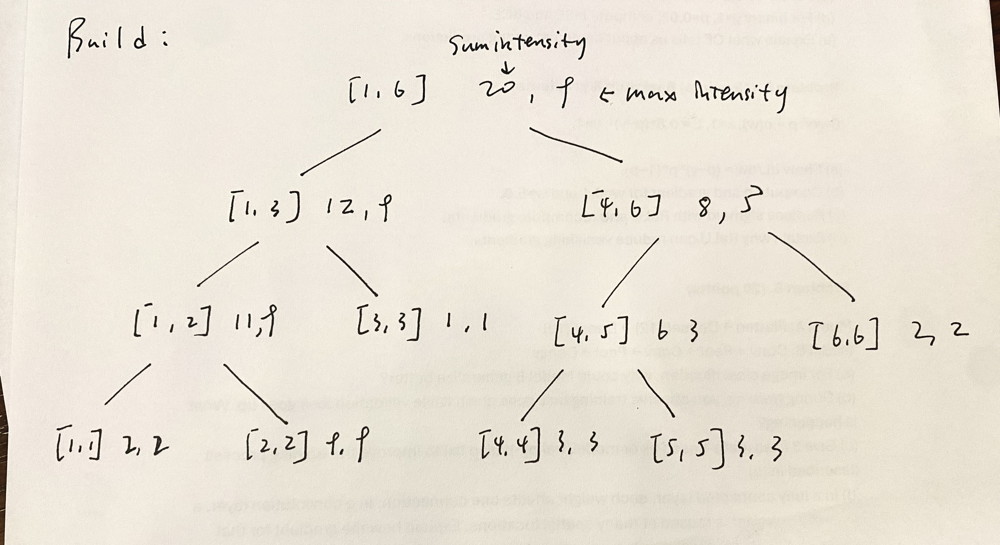
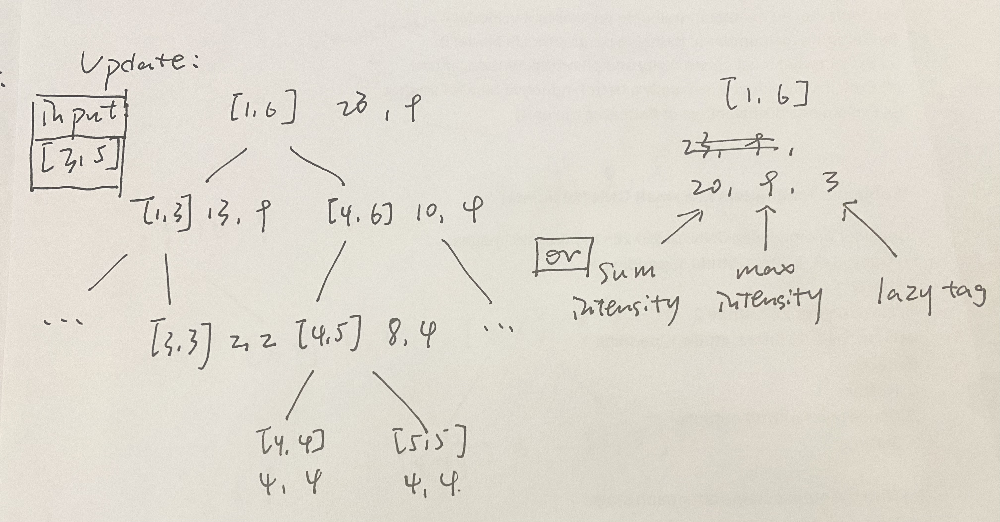
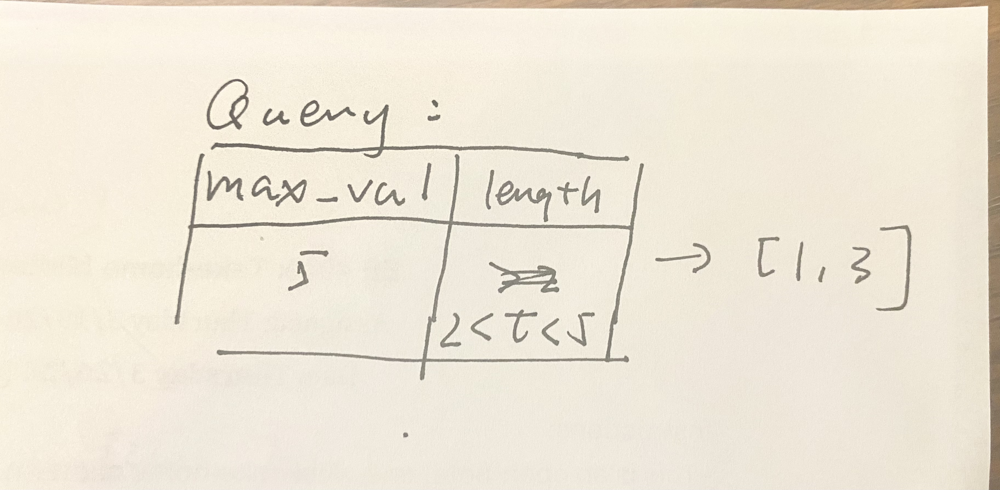

# Developer Blog: Building the Highlight Optimizer

## Log: 2026-03-22 | Data Strategy & Simulator

Professor pointed out the difficulty of finding a real-world dataset. I spent today designing the initial structure of this project and building a Synthetic Data Simulator in Python.

### Initial structure design
#### Divide and Conquer

* Dividing video into 1 second long clips (leaf node). Assign each node with 2 values: sum intensity and max intensity for fast and precise pruening.

* The algorithm recursively divides the video timeline. If a subtree represents an atomic unit, it hits the base case, and the task is conquered at this level by assigning the initial intensity. As the recursion unwinds, the algorithm combines the results from the subtrees to recalculate the max_intensity and sum_intensity of the parent node. This bottom-up synchronization continues until it reaches the root node, returning a fully initialized and consistent Segment Tree.

* Or using a lazy tag

* The final extraction process utilizes a Pre-order Pruning Search. Instead of physically mutating the tree, the query function performs a conditional traversal. By evaluating the max_intensity and interval_length at the parent level first, the algorithm can prune entire sub-branches that fall below the threshold, effectively ignoring irrelevant data. This results in a highly efficient $O(K \log N)$ search, returning an array of qualified interval descriptors for the final greedy selection.

#### Greedy
* The greedy prioritizes segments with the highest 'heat density,' (sum density/length) ensuring that the final 300-second montage maximizes audience engagement within the fixed temporal budget.

#### Extenstion
If time permits, I will implements a state-aware selection process. After selecting a high-intensity 'Peak,' the algorithm searches for a lower-intensity 'Valley' to provide pacing and narrative relief, mimicking professional film editing flow.

---

* **Challenge**: Random intervals don't represent real "high moments."
* **Solution**: I implemented "event anchors." The simulator picks a random timestamp (e.g., a goal) and generates a Gaussian cluster of tags around it. This tested the Segment Tree's ability to handle high-density overlaps, which is where generic implementations usually fail.